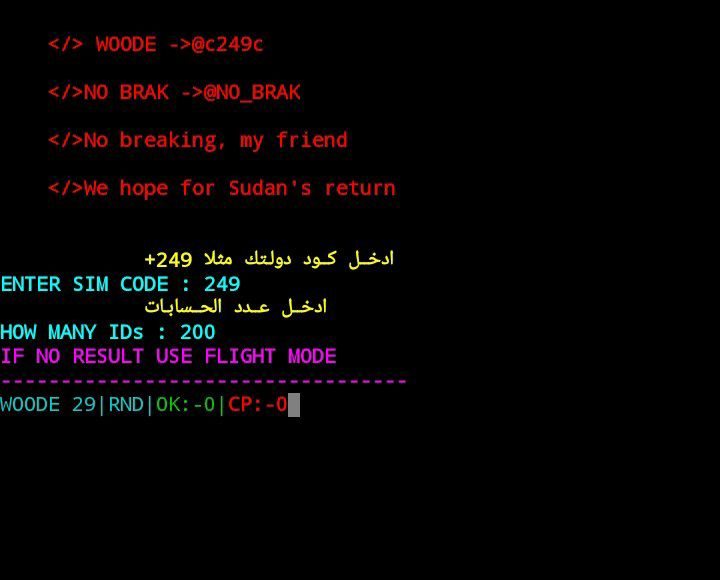

# Random
FB &lt;/> RANDOM ★

Using the randomness library💣

[My channel Telegram](https://t.me/NO_BRAK)

How are the inputs used in the code?

1. The program generates random phone numbers based on the entered SIM code.

2. Multiple passwords are tested on each random number.

3. If the login credentials are correct, the account is recorded as hacked (OK).

4. If the account requires Facebook identity verification, it is recorded as a locked account (CP).

